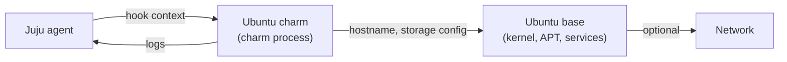

# Security policy

## Product architecture

The Ubuntu charm is a packaging-layer charm that deploys a pristine Ubuntu Server image and applies a small amount of configuration (hostname, mounted storage). It runs no daemons of its own and exposes no network surface beyond what the base Ubuntu image and the operator's deployment add.

The diagram below shows where the Ubuntu charm sits and the trust boundaries that follow:

More detail:

- **Juju ↔ charm code:** the charm receives configuration and lifecycle events from Juju over the standard Juju agent channel; no network listener is opened by the charm itself.
- **Charm → Ubuntu base:** the charm applies hostname and storage configuration to the underlying Ubuntu base, which is the security boundary for everything else (kernel, package set, default services).
- **Ubuntu base → network:** any network-exposed services are part of the Ubuntu base or layered on by the operator, not by this charm.

## Secure by design

The Ubuntu charm is intentionally minimal:

- No cryptography is implemented or configured by the charm.
- No long-running processes are started by the charm.
- No secrets are generated, stored, or handled by the charm; Juju secrets are not used.
- The charm relies on the Ubuntu base's security posture: `apt`/`snapd` update channels, AppArmor profiles, `unattended-upgrades` when enabled.

The best way to reduce operational risk is to deploy with the most recent Ubuntu LTS release as the base.

## Cryptography

The Ubuntu charm does not implement, configure, or expose any cryptographic technology. TLS, package signing, storage encryption, and kernel-level crypto are all provided by the Ubuntu base and the [Ubuntu FIPS-certified cryptographic modules](https://documentation.ubuntu.com/security/compliance/fips/fips-overview/), which the charm does not override.

There is no encryption at rest applied by the charm. Any disk encryption must be configured by the operator at the Ubuntu base level — for example LUKS at install time, or filesystem-level encryption on the storage volumes the charm attaches.

## Hardening

To harden a deployment of the Ubuntu charm, harden the Ubuntu base:

- [Ubuntu server security documentation](https://ubuntu.com/server/docs/explanation/intro-to/security/) — kernel hardening, AppArmor, `auditd`, `ufw`.
- [CIS benchmarks for Ubuntu](https://documentation.ubuntu.com/security/compliance/usg/cis-benchmarks/) — CIS Level 1 / Level 2 hardening; Ubuntu Pro provides `ubuntu-security-guide` for automated application.
- [Juju hardening](https://canonical.com/juju/docs/juju-cli/3.6/howto/manage-your-juju-deployment/harden-your-juju-deployment/#harden-the-controller-s) — controller-side hardening.

The charm itself adds no further hardening surface; once the base and the controller are hardened, there is nothing extra to do in the charm.

## Logging and monitoring

The charm emits only standard charm logs, surfaced through `juju debug-log` using Juju's own log levels and storage.

The Ubuntu charm emits no structured security events under the [OWASP application logging vocabulary](https://cheatsheetseries.owasp.org/cheatsheets/Logging_Vocabulary_Cheat_Sheet.html): the charm has no authentication, authorisation, admin, or user-management surface, so there is nothing for it to instrument. Operational monitoring of the underlying Ubuntu base (`journalctl`, `auditd`, syslog) is the operator's responsibility and uses the standard Ubuntu mechanisms.

## Decommissioning

To remove a deployment of the Ubuntu charm, run `juju remove-application ubuntu`. Juju tears down the unit and releases the underlying machine, its storage volumes, and any attached block devices to the cloud provider. The Ubuntu base image contains no persistent charm state once the unit is removed.

`juju remove-application` releases storage volumes but does not securely erase data already written to them. If a removed unit's volumes contained sensitive data, wipe or destroy the volumes at the cloud-provider level as a separate step.

## Security lifecycle

The security support lifetime for a deployment of the Ubuntu charm mirrors the [Ubuntu release lifecycle](https://ubuntu.com/about/release-cycle) of the base being deployed. LTS releases receive standard security maintenance for 5 years; interim releases receive security maintenance for 9 months. Once a given Ubuntu base reaches end-of-life, that base is no longer security-maintained in this project.

The charm is distributed on [Charmhub](https://charmhub.io/ubuntu) on a single `latest` track with `stable`, `candidate`, and `edge` risk levels. The Ubuntu base targeted by a given deployment is selected at deploy time with `--base`, not by picking a track. Revisions on the `latest` track are ordered chronologically.

Security updates are delivered through two channels:

- **Ubuntu base updates** — `apt` from the Ubuntu archive on each unit; `unattended-upgrades` (if enabled by the operator) applies them automatically. This is the channel for kernel, library, and system package CVEs.
- **Charm refreshes** — published to [Charmhub](https://charmhub.io/ubuntu); operators receive updates by running `juju refresh ubuntu`. Charm-level security fixes (to the charm code itself) are delivered this way.

To verify the deployed charm revision, run `juju status` and compare the `Charm rev` column for the `ubuntu` application against the revision listed on [Charmhub](https://charmhub.io/ubuntu).

## Reporting a vulnerability

The easiest way to report a security issue is through [GitHub's security advisories for this project](https://github.com/canonical/charm-ubuntu/security/advisories/new). See [Privately reporting a security vulnerability](https://docs.github.com/en/code-security/security-advisories/guidance-on-reporting-and-writing/privately-reporting-a-security-vulnerability) for instructions on using the feature. You may also email `security@ubuntu.com`. To encrypt your email, follow [Canonical's reporting instructions](https://ubuntu.com/security/disclosure-policy#contact-us).

Please include a description of the issue, the steps you took to find it, affected versions, and, if known, mitigations.

The charm's maintainers will be notified and will work with you to determine whether the issue qualifies as a security issue and, if so, in which component. We then figure out a fix, get a CVE assigned, and coordinate the release of the fix. Our vulnerability management team intends to respond within 3 working days of your report, and this project aims to resolve all vulnerabilities within 90 days. If you have a deadline for public disclosure, please let us know.

The [Ubuntu Security disclosure and embargo policy](https://ubuntu.com/security/disclosure-policy) contains more information about what you can expect when you contact us, and what we expect from you.

To stay informed about Ubuntu charm vulnerabilities, watch:

- The [GitHub Security Advisories for `canonical/charm-ubuntu`](https://github.com/canonical/charm-ubuntu/security/advisories).
- The charm's release history on [Charmhub](https://charmhub.io/ubuntu).
- Relevant [Ubuntu Security Notices](https://ubuntu.com/security/notices) when a vulnerability also affects the Ubuntu base bundled with this charm.
